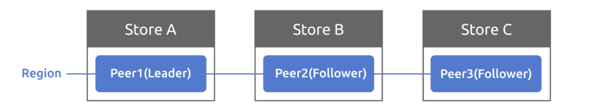

* [Tinykv summary](#tinykv-summary)
   * [一、 整体完成情况](#一-整体完成情况)
   * [二、 收获与感受](#二-收获与感受)
   * [三、个人RoadMap](#三个人roadmap)
   * [四、Projects](#四projects)
      * [4.1 Project 1 StandaloneKV](#41-project-1-standalonekv)
         * [概念补充](#概念补充)
         * [Write调用流程](#write调用流程)
         * [问题及解决方法](#问题及解决方法)
      * [4.2 Project 2A Basic raft algorithm](#42-project-2a-basic-raft-algorithm)
         * [Leader election](#leader-election)
         * [Log replication](#log-replication)
         * [Raw node interface](#raw-node-interface)
         * [测试模拟分析](#测试模拟分析)
         * [问题及解决方法](#问题及解决方法-1)
      * [4.3 Project 2B RaftGroup](#43-project-2b-raftgroup)
         * [总体设计](#总体设计)
         * [处理Raft Msg](#处理raft-msg)
         * [处理Raft Ready](#处理raft-ready)
         * [问题及解决方法](#问题及解决方法-2)
      * [4.4 Project 2C Snapshot](#44-project-2c-snapshot)
         * [Snapshot 发送](#snapshot-发送)
         * [Snapshot接收](#snapshot接收)
         * [问题及解决方案](#问题及解决方案)
      * [4. 4 Project 3A ConfChange](#4-4-project-3a-confchange)
         * [ConfChange流程](#confchange流程)
         * [Transfer Leader流程](#transfer-leader流程)
         * [问题及解决方法](#问题及解决方法-3)
      * [4.5 Project 3B Split](#45-project-3b-split)
         * [Split流程](#split流程)
         * [问题及解决方法](#问题及解决方法-4)
      * [4.6 Project 3C](#46-project-3c)
         * [Collect region heartbeat](#collect-region-heartbeat)
         * [region balance scheduler](#region-balance-scheduler)
         * [问题及解决方法](#问题及解决方法-5)
      * [4.7 Project 4 Transaction](#47-project-4-transaction)
         * [Project 4A](#project-4a)
         * [Project 4B](#project-4b)
         * [Project 4C](#project-4c)
         * [问题及解决方法](#问题及解决方法-6)

# Tinykv summary

本文档记录了[tinykv2020](https://github.com/tidb-incubator/tinykv)学习过程中遇到的问题、对每个Project的梳理理解，Tikv分为4个Project。

## 一、 整体完成情况

2B不能每次跑都通过，3C部分测试没通过。

- [x] [Project1 - StandaloneKV](https://github.com/tidb-incubator/tinykv/blob/course/doc/project1-StandaloneKV.md)
- [x] [Project2 - RaftKV](https://github.com/tidb-incubator/tinykv/blob/course/doc/project2-RaftKV.md)
- [ ] [Project3 - MultiRaftKV](https://github.com/tidb-incubator/tinykv/blob/course/doc/project3-MultiRaftKV.md)
- [x] [Project4 - Transaction](https://github.com/tidb-incubator/tinykv/blob/course/doc/project4-Transaction.md)

## 二、 收获与感受

* 单机与并发

  Project 1, 2a, 3a, 3c, 4a, 4b, 4c为单机测试，debug相对更加容易，可以一步一步的查看状态变化。

  Project 2b, 2c, 3b为多客户端并发测试且涉及到超时等与时间相关的函数，出错的情况更多，不能一步一步的调，采用的是log在关键函数输出信息，错误更难发现，后续需要进一步学习并发调试技巧。

* 宏观与具体

  整个tinykv项目框架不小，如果没有文档会不知道怎么下手，在文档的指示下，从Project 1切入刚好可以增强对tinykv和Go语言的了解，能够较平稳过渡到2a的raft算法实现，在实现完raft算法开始做2b的时，发现2b要考虑的文件数量远比之前的项目要多，刚开始看的时候掉进了看得太具体的陷阱，在通过与实验室同学交流讨论之后，慢慢开始从宏观上学习理清代码框架，这种方法对2b之后的项目帮助不小，后续需要进一步学习源码阅读技巧，提高效率。

非常感谢PingCap公司给我们提供了一个非常优秀具有强烈工业背景的学习项目，这个项目脱胎于TiDB和TiKV，通过学习tinykv，对Raft算法有了更深的理解，对TiKv的multi raft架构有了具体的认识，也明白了自己的许多不足。后续PingCap公司也有意对tinykv进行优化完善，希望这个项目能越做越好。

## 三、个人RoadMap

- [x] 学习tinykv
- [ ] 学习tinysql,tinyscheduler
- [ ] 学习TiDB，争取从TiDB中提取出工业问题，形成研究生毕设题目。
- [ ] 争取参加talent challenge plan 
- [ ] 争取成为tidb contributor 

## 四、Projects

### 4.1 Project 1 StandaloneKV

> Build a standalone key/value storage gRPC service with the support of the column family based on [badger](https://github.com/dgraph-io/badger) API. 

Project1 要基于底层的badger实现Put,Write,Get等接口，涉及到的src file、test file和Reference如下：

**src file**

* kv/server/server.go 

  封装底层storage以提供RawPut,RawDelete,RawGet,RawScan接口。

* kv/storage/standalone_storage/standalone_storage.go 

  处理server接口的调用，读写底层Bader.DB的kv和raft engine。

**test file**

* kv/server/server_test.go

**Reference**

* [Project1 StandaloneKV Docs](https://github.com/tidb-incubator/tinykv/blob/course/doc/project1-StandaloneKV.md)

* [Column family](https://en.wikipedia.org/wiki/Standard_column_family)

#### 概念补充

* **列族（column family）**

  列族提供了一种从逻辑上给数据库分片的方法，在生产环境中如果没有指定Column Family，键值对将会结合到“default” 列族。在tinykv中，对column family的支持由自带代码及底层badger提供，在完成Project的时几乎可以不考虑。

* **Badger** 

  > BadgerDB is an embeddable, persistent and fast key-value (KV) database written in pure Go.

  通过浏览Badger官方提供的[开始文档](https://dgraph.io/docs/badger/get-started/)可以了解其使用方法,其提供transaction支持，新建时通过bool变量生成`writable`和`readonly`两种事务，读写由`txn.Set()`和txn.Get()函数提供，使用完之后需要调用`txn.Dsicard()`或`txn.Commit()`。

  ```GO
  // Start a writable transaction.
  txn := db.NewTransaction(true)
  defer txn.Discard()
  
  // Use the transaction...
  err := txn.Set([]byte("answer"), []byte("42"))
  if err != nil {
      return err
  }
  
  // Commit the transaction and check for error.
  if err := txn.Commit(); err != nil {
      return err
  }
  ```

#### Write调用流程

Project 1在搞清楚Badger的基本使用后就可以从测试文件入手编写了，因为是第一个项目且单机测试，比较好入手，下面以写操作（Put）为例，介绍调用流程和代码实现，为方便展示，部分不重要代码会被省略。

1. NewStandAloneStorage

   存储引擎有两个Badger.DB：Raft engine和kv engine，两者作用不同，前者主要存储raft日志，后者主要是状态机信息，Project 1中只使用到了kv engine。

    ```go
    func NewStandAloneStorage(conf *config.Config) *StandAloneStorage {
        // Your Code Here (1).
        ...
        kvEngine := engine_util.CreateDB(kvPath, false)
        raftEngine := engine_util.CreateDB(raftPath, true)

        engine := engine_util.NewEngines(kvEngine, raftEngine, kvPath, raftPath)

        return &StandAloneStorage{engine: *engine}
    }
    ```

1. TestRawPut

   RawPut函数把key为99，value为42的键值对写入默认的column family后，使用Get()函数比较写入是否正确。
   
   ```go
   func TestRawPut1(t *testing.T) {
   	conf := config.NewTestConfig()
   	s := standalone_storage.NewStandAloneStorage(conf)
       ...
   	cf := engine_util.CfDefault
   	req := &kvrpcpb.RawPutRequest{
   		Key:   []byte{99},
   		Value: []byte{42},
   		Cf:    cf,
   	}
   	
       _, err := server.RawPut(nil, req)
   
   	got, err := Get(s, cf, []byte{99})
   	assert.Nil(t, err)
   	assert.Equal(t, []byte{42}, got)
   }
   ```
   
1. Server.RawPut

   RawPut接口会把Put操作封装成包含Put操作具体信息的Modify结构，除Put外Modify还支持Delete操作。

   ```go
   func (server *Server) RawPut(_ context.Context, req *kvrpcpb.RawPutRequest) (*kvrpcpb.RawPutResponse, error) {
   	// Your Code Here (1).
   	put := storage.Put{Key: req.Key, Value: req.Value, Cf: req.Cf}
   	batch := storage.Modify{Data: put}
       
   	// args2:array
   	err := server.storage.Write(req.Context, []storage.Modify{batch})
   	if err != nil {
   		return &kvrpcpb.RawPutResponse{Error: err.Error()}, err
   	}
   
   	return &kvrpcpb.RawPutResponse{}, nil
   }
   ```

1. storage.Write

   传参的时候需要注意Write接口定义的是数组，以支持batch操作。因为Modify有Put和Delete两种可能，所以需要根据其操作类型调用不同的函数PutCF()和DeleteCF()。

   ```go
   func (s *StandAloneStorage) Write(ctx *kvrpcpb.Context, batch []storage.Modify) error {
   	// Your Code Here (1).
   	for _, b := range batch {
   		switch b.Data.(type) {
   		case storage.Put:
   			err := engine_util.PutCF(s.engine.Kv, b.Cf(), b.Key(), b.Value())
   			...
   		case storage.Delete:
   			err := engine_util.DeleteCF(s.engine.Kv, b.Cf(), b.Key())
   			...
   		}
   	}
   	return nil
   }
   ```

5. engine_util.PutCF

   以PutCF为例,PutCF对指定的engine这里是kv engine对应的column family执行对应的读写操作，写是Set(),其中Update()是badger提供的API，其定义和概念补充示例代码类似。

   ```go
   func PutCF(engine *badger.DB, cf string, key []byte, val []byte) error {
   	return engine.Update(func(txn *badger.Txn) error {
   		return txn.Set(KeyWithCF(cf, key), val)
   	})
   }
   ```

#### 问题及解决方法

1. StandAloneStorage.Reader接口定义的是要返回一个`storage.StorageReader`接口。

   ```go
   type StorageReader interface {
   	// When the key doesn't exist, return nil for the value
   	GetCF(cf string, key []byte) ([]byte, error)
   	IterCF(cf string) engine_util.DBIterator
   	Close()
   }
   ```

   根据接口定义的方法和测试代码展示的方法功能实现这个接口。

   ```go
   func (s *StandAloneStorage) Reader(ctx *kvrpcpb.Context) (storage.StorageReader, error) {
   	// Your Code Here (1).
   	return NewStandAloneReader(s.engine.Kv.NewTransaction(false))
   }
   ```

2. Project 1中有很多实际对Badger的操作都放在了`engine_util/util.go`文件中，需要大致浏览。

### 4.2 Project 2A Basic raft algorithm

> Raft is a consensus algorithm that is designed to be easy to understand. In this part, you will implement the basic raft algorithm.This part can be broken down into 3 steps, including:
>
> - Leader election          **2aa**
> - Log replication           **2ab**
> - Raw node interface   **2ac**

Project 2A是对raft基本算法的实现，是2aa和2ab，本小节将分别从Leader election和Log replication两个角度阐述Raft算法的具体实现。涉及的src file、test file和Reference如下：

**src file**

* raft/log.go 

  RaftLog封装底层raft engine(Badger.DB)，提供内存和磁盘的日志存储。

* raft/raft.go

  实现不同身份(Leader,Candidate,Follower)在Raft算法中的状态变化。

* raft/rawnode.go

  Rawnode封装Raft,是与上层应用交互的接口，提供Ready(),Advance()等API。

**test file**

* raft/raft_paper_test.go **2aa&2ab**
* raft_test.go                     **2aa&2ab**
* rawnode_test.go           **2ac** 

**Reference**

* [Project2A Docs](https://github.com/tidb-incubator/tinykv/blob/course/doc/project2-RaftKV.md/#part-a)

* [the Raft site](https://raft.github.io/)
* [the extended Raft paper](https://raft.github.io/raft.pdf)
* [etcd](https://github.com/etcd-io/etcd) tinykv的raft实现和etcd的比较类似，实现过程中有部分参考etcd。

#### Leader election

1. tickElection

   对于follower使用逻辑tick时钟来触发身份转变为candicate并发起选举，对其他peer发送sendRequestVote请求。

   ```go
   func (r *Raft) tickElection() {
   	r.electionElapsed++
   	if r.electionElapsed >= r.randomElectionTimeout {
   		r.electionElapsed = 0
   		r.Step(pb.Message{MsgType: pb.MessageType_MsgHup})
   	}
   
   }
   ```

2. sendRequestVote

   由Candidate 发起投票，RequestVote RPC除了携带任期号和id外，还需要带自己最新的日志索引和对应的任期号，这是为了在选举时能够选出数据最新的节点作为新的Leader。

   * Term: Candidate的当前任期，为原任期号+1

   * lastLogIndex: Candidate最新一条日志的

   * lastLogTerm: 最新日志的Term

   ```go
   	r.Term++	
   	lastIdx := r.RaftLog.LastIndex()
   	lastTerm, err := r.RaftLog.Term(lastIdx)
   	...
   func (r *Raft) sendRequestVote(to uint64, lastIdx uint64, lastTerm uint64) {
   	msg := pb.Message{
   		MsgType: pb.MessageType_MsgRequestVote,
   		From:    r.id,
   		To:      to,
   		Term:    r.Term,
   		LogTerm: lastTerm,
   		Index:   lastIdx,
   	}
   	r.msgs = append(r.msgs, msg)
   }
   ```

3. handleRequestVote

   raft peer在接收到一个candidate发送的requestvote请求之后，根据不同情况条件，给candidate发送一个sendRequestVoteResponse表示是否同意候选人当选当选为leader。

   * 1（编号对应代码注释） 如果follower的任期号大于candidate的任期号，拒绝投票，并且带上自己的任期号
   * 2.a 如果follower已经投票给其他candidate，拒绝投票
   * 2.b 如果follower的日志比candidate的新，拒绝投票
   * 否则同意投票，并更新自己的Term

   ```go
   func (r *Raft) handleRequestVote(m pb.Message) {
   	// 1. Reply false if term < currentTerm
   	if m.Term != None && m.Term < r.Term {
   		r.sendRequestVoteResponse(m.From, true)
   		return
   	}
   	// 2.a if voteFor is not null
   	if r.Vote != None && r.Vote != m.From {
   		r.sendRequestVoteResponse(m.From, true)
   		return
   	}
   	//2.b or candidateId,and candidate's log
   	// is at least as up-to=date as receiver'slog,grant vote
   	lastIdx := r.RaftLog.LastIndex()
   	lastLogTerm, err := r.RaftLog.Term(lastIdx)
   	...
   	if lastLogTerm > m.LogTerm || lastLogTerm == m.LogTerm && lastIdx > m.Index {
   		r.sendRequestVoteResponse(m.From, true)
   		return
   	}
       r.becomeFollower(m.Term, None) // set Term and resetTimer
   	r.Vote = m.From
   	...
   	r.sendRequestVoteResponse(m.From, false)
   }
   ```

4. handleRequestVoteResponse

   candidate收到follower的RequestVoteResponse后调用handleRequestVoteResponse函数，会根据所获得的票数来决定是否当选

   * 当follower同意的票数>Prs/2数量时，执行becomeLeader()

   * 当follower拒绝的票数>Prs/2数量时，执行becomefollower()

   ```go
   func (r *Raft) handleRequestVoteResponse(m pb.Message) {
   	if m.Term != None && m.Term < r.Term {
   		return
   	}
   	r.votes[m.From] = !m.Reject
   	grant := 0
   	votes := len(r.votes) // # of vote peer
   	// int div 5/2=2,6/2=3
   	// so grant(vote) should > threshold
   	threshold := len(r.Prs) / 2
   	for _, g := range r.votes {
   		if g {
   			grant++
   		}
   	}
   	if grant > threshold {
   		r.becomeLeader()
   	} else {
   		if (votes - grant) > threshold {
   			r.becomeFollower(r.Term, None)
   		}
   	}
   }
   ```

5. becomeLeader

   成为leader之后，为了避免出现论文图8所示的情况，在当选时，leader需要给follower发送一个空entry。

   

   展开描述图(c)

   - leader 会尝试完成 commiting 之前 term 的日志项
     
   - 第3项日志（term 2）不会安全地 committed：
     - s5可以被选举为 term5 的 leader
     - 如果s5成为 leader，它将覆盖在s1、s2、s3的第3项日志

   所以论文要求了不能commit之前term的日志，Leader当选之后补发一个noop Entry，可以将noop Entry和之前term的日志一起commit。
   
   ```go
   func (r *Raft) becomeLeader() {
   	// Your Code Here (2A).
   	// NOTE: Leader should propose a noop entry on its term
   	r.State = StateLeader
   	r.Lead = r.id
   	r.heartbeatElapsed = 0
   	lastIdx := r.RaftLog.LastIndex()
   	for p := range r.Prs {
   		if p == r.id { // because of noop entry
   			r.Prs[p].Next = lastIdx + 2
   			r.Prs[p].Match = lastIdx + 1
   		} else {
   			r.Prs[p].Next = lastIdx + 1
   		}
   	}
   	// ** append empty entry
   	r.RaftLog.entries = append(r.RaftLog.entries, pb.Entry{Term: r.Term, Index: lastIdx + 1})
   	r.bcastAppend()
   	...
   }
   ```

#### Log replication

上节的发送空entry就涉及到了Log replication，本节将介绍其具体流程与实现。

> Note that, unlike Raft paper, it divides Heartbeat and AppendEntries into different messages to make the logic more clear.

1. sendAppend

   bcastAppend()对所有follower调用sendAppend()函数

   AppendEntries RPC
   
   * Term: leader的Term 
   * preLogIndex: 为nextIndex-1,这个属性会用于判断该AppendEntries是否可以接收
   * preLogTerm：prevLogIndex 条目的Term 
   * entries[]: 从nextIndex到最新的Index的所有log日志
   * leaderCommit：当前leader的CommitIndex，用于更新follower的commitIndex
   
   ```go
    func (r *Raft) sendAppend(to uint64) bool {
        // Your Code Here (2A).
        ... Snapshot
        // could not use Match, because match may be 0,like (0,11)
        prevIdx := r.Prs[to].Next - 1
        prevLogTerm, err := r.RaftLog.Term(prevIdx)
        var entries []*pb.Entry
        for i := r.RaftLog.toSliceIndex(r.Prs[to].next); i < len(r.RaftLog.entries); i++ {
            entries = append(entries, &r.RaftLog.entries[i])
        }
   
        msg := pb.Message{
            MsgType: pb.MessageType_MsgAppend,
            From:    r.id,
            To:      to,
            Term:    r.Term,
            Commit:  r.RaftLog.committed, // used for leader to sync committed number with follower
            LogTerm: prevLogTerm,
            Index:   prevIdx,
            Entries: entries,
        }
        r.msgs = append(r.msgs, msg)
        return true
    }
   ```

2. handleAppendEntries

   * 1（编号对应代码注释） 如果follower的任期号大于老leader的任期号，拒绝并带上自己的任期号

   * 2 如果follower的最新的日志索引（lastIdx）比leader认为的match index(m.Index)更大，则拒绝并将lastIdx+1（下一个想要的index）发给leader，以便leader更新next和match并重发。

     如果m.Index <= lastIdx 且 m.Index > follower的Raftlog.FirstIndex，则检查m.Index对应的Term是否与RaftLog中entry的Term匹配。

     如果不匹配处理有三种以上的方式（下面实现的是第二种）：

     

     * 简单粗暴的方法是一个Entry一个Entry的处理，返回m.index - 1，效率较低，如上图所示
     * 甚至可以直接把Follower的entries发给leader，由leader自己检查并更新next和match
     * 这边实现的原论文提到的优化：可以一个Term一个Term的处理 返回 **LogTerm(**PreLogIndex在Follower的Entries对应的Term)和**NextIndex**（Follower的Entries包含这个LogTerm最小的Index）同样以上图情况为例：
       * 第一次Leader发送的PreLogIndex=10, PreLogTerm=6, entries= 为index11及之后
       * Follower检查PreLogIndex=10对应的LogTerm=3 != PreLogTerm=6，冲突，返回给Leader：LogTerm=3, NextIndex=7(下一个可能想要的entry开始的index，即Term为3的left most索引)
       * 第二次Leader发送 PreLogIndex=6, PreLogTerm=5，entries=index7及之后
       * Follower检查PreLogIndex=6对应的LogTerm=2 != PreLogTerm=5，冲突，返回给Leader：LogTerm=2， NextIndex=4
       * 第三次Leader发送 PreLogIndex=3, PreLogTerm=1，entries=index3及之后
       * Follower检查PreLogIndex=3对应的LogTerm=PreLogTerm=1, 不冲突，接收Entries

   * 3 截断后面冲突的entries

   * 4 复制剩余的entries

   * 5 更新commit

   ```go
   func (r *Raft) handleAppendEntries(m pb.Message) {
   	// Your Code Here (2A).
   	lastIdx := r.RaftLog.LastIndex()
   	// 1. Replay false if term < currentTerm
   	if m.Term < r.Term {
   		r.sendAppendResponse(m.From, true, None, None)
   		return
   	}
   	// 2. Replay false if log doesn't contain an entry at prevLogIndex
   	// whose term matches prevLogTerm
   	if m.Index > lastIdx {
   		// need from lastIdx+1
   		r.sendAppendResponse(m.From, true, None, lastIdx+1)
   		return
   	}
   
   	l := r.RaftLog
   	if m.Index >= l.FirstIndex {
   		logTerm, err := l.Term(m.Index)
   		if err != nil {
   			panic(err)
   		}
   		if logTerm != m.LogTerm {
               // sort.Search(length,find_conditon)
   			// idx:
   			//     found: the smallest(left most) idx of logTerm
   			// not fount: not found unreachable
   			idx := l.toEntryIndex(sort.Search(l.toSliceIndex(m.Index+1),
   				func(i int) bool { return l.entries[i].Term == logTerm }))
   			r.sendAppendResponse(m.From, true, logTerm, idx)
   			return
   		}
   	}
   
   	for i, entry := range m.Entries {
   		if entry.Index < l.FirstIndex {
   			continue
   		}
   		if entry.Index <= l.LastIndex() {
   			logTerm, err := l.Term(entry.Index)
   			if err != nil {
   				panic(err)
   			}
   			// 3. If an existing entry conflicts with a new one
   			// (same index but different terms),
   			// delete the existing entry and all that follow it
   			if logTerm != entry.Term {
   				sliceIdx := l.toSliceIndex(entry.Index)
   				l.entries[sliceIdx] = *entry
   				l.entries = l.entries[:sliceIdx+1]
   				l.stabled = min(entry.Index-1, l.stabled)
   			}
   		} else {
   			// 4. Append any new entries not already in the log
   			// we can add one by one too,but slower
   			for j := i; j < len(m.Entries); j++ {
   				l.entries = append(l.entries, *m.Entries[j])
   			}
   			break
   		}
   	}
   	// 5. If leaderCommit > commitIndex,set commitIndex =
   	// min(leaderCommit,index of last new entry)
   	if m.Commit > l.committed {
   		l.committed = min(m.Commit, m.Index+uint64(len(m.Entries)))
   	}
   	r.sendAppendResponse(m.From, false, None, l.LastIndex())
   }
   ```

3. handleAppendEntriesResponse

   handleAppendEntriesResponse根据follower拒绝与否可以分为两种情况：
   
   * 拒绝 根据follower返回的m.LogTerm和m.Index（下一个可能想要的Index），重新通过Append RPC把从m.Index开始的entries和m.Index前面一个entry的PreLogIndex和PreLogTerm发给Follower
   * 同意 则更新leader维护的关于这个follower的next和match字段
   * 当Follower接受Entries可能会达成commit条件，需要调用leaderCommit函数
   
   ```go
   func (r *Raft) handleAppendEntriesResponse(m pb.Message) {
   	if m.Term != None && m.Term < r.Term {
   		return
   	}
   	if m.Reject {
   		idx := m.Index
   		if idx == None {
   			return
   		}
           // fast case
   		if m.LogTerm != None {
   			logTerm := m.LogTerm
   			l := r.RaftLog
   			// sliceIdx:
               //         found: idx who's term larger than logTerm
   			//     not found: len(l.entries)
   			sliceIdx := sort.Search(len(l.entries),
   				func(i int) bool { return l.entries[i].Term > logTerm })
   			if sliceIdx > 0 && l.entries[sliceIdx-1].Term == logTerm {
   				idx = l.toEntryIndex(sliceIdx)
   			}
   		}
   		r.Prs[m.From].Next = idx
   		r.sendAppend(m.From)
   		return
   	}
   	// leaderCommit iff follower append entries
   	if m.Index > r.Prs[m.From].Match {
   		r.Prs[m.From].Match = m.Index
   		r.Prs[m.From].Next = m.Index + 1
   		r.leaderCommit()
   	}
   	...
   }
   ```
   
4. leaderCommit

   举例说明：

   * 奇数情况 match = 5, 5, 5, 6, 7, 7, 8 (从小到大排序)，取 match[(len(match)-1)/2]=3                    match[3]=6
   * 偶数情况 match = 5, 5, 5, 6, 7, 7, 8, 9 (从小到大排序)，取match[(len(match)-1)/2]=(8-1) / 2=3 match[3]=6

   ```go
   func (r *Raft) leaderCommit() {
   	match := make(uint64Slice, len(r.Prs))
   	i := 0
   	for _, prs := range r.Prs {
   		match[i] = prs.Match
   		i++
   	}
   	sort.Sort(match)
   	n := match[(len(match)-1)/2]
   	// reflesh r.RaftLog.committed
   	if n > r.RaftLog.committed {
   		logTerm, err := r.RaftLog.Term(n)
   		if err != nil {
   			panic(err)
   		}
   		// do not commit log entries in previous terms
   		if logTerm == r.Term {
   			r.RaftLog.committed = n
   			r.bcastAppend()
   		}
   	}
   }
   ```

#### Raw node interface

Rawnode将底层raft封装起，对上层应用提供一些必须的接口。理清这部分的作用有助于加深对后续Project的整体理解。

```go
// 2aa,2ab中涉及到的基本功能
func (rn *RawNode) Tick()
func (rn *RawNode) Campaign()
func (rn *RawNode) Propose(data []byte) 
func (rn *RawNode) Step(m pb.Message)
// 3c ConfChange和Leader Transfer
func (rn *RawNode) ProposeConfChange(cc pb.ConfChange)
func (rn *RawNode) ApplyConfChange(cc pb.ConfChange) *pb.ConfState
func (rn *RawNode) TransferLeader(transferee uint64)
// 处理msg、snapshot、hardState softState等
func (rn *RawNode) Ready()
func (rn *RawNode) HasReady() 
func (rn *RawNode) Advance(rd Ready) 
```

​	上面是RawNode对上层应用提供的API，可以简单分类三类：2aa,2ab中涉及到的基本功能,3c涉及到的关于ConfChange和Leader Transfer功能的API和上层应用发现是否有变化要处理的Ready相关API。下面主要介绍第三种的作用和实现。

1. PeermsgHandler.HandleRaftReady

   PeermsgHandler 通过调用RawNode提供的HasReady函数判断是否有新的变化需要处理，如果有则获取其的Ready并处理之。

   ```go
   func (d *peerMsgHandler) HandleRaftReady() {
   	if d.stopped {
   		return
   	}
   	// Your Code Here (2B).
   	if d.RaftGroup.HasReady() {
   		rd := d.RaftGroup.Ready()
           ... 处理 Ready
           d.RaftGroup.Advance(rd)
   ```

2. HasReady

	HasReady主要监控以下几个方面：

   * softState的变化
   * hardState的变化
   * unstable entries
   * 未commit entries
   * 新msgs
   * pendingSnapshot
   
    ```go
    func (rn *RawNode) HasReady() bool {
        // Your Code Here (2A).
        r := rn.Raft
        if !r.softState().equal(rn.prevSoftSt) {
            return true
        }
        if hardSt := r.hardState(); !IsEmptyHardState(hardSt) && !isHardStateEqual(hardSt, rn.prevHardSt) {
            return true
        }
        if len(r.RaftLog.unstableEntries()) > 0 ||
            len(r.RaftLog.nextEnts()) > 0 ||
            len(r.msgs) > 0 {
            return true
        }
        // snapshot
        if !IsEmptySnap(r.RaftLog.pendingSnapshot) {
            return true
        }
        return false
    }
    ```
   
3. Ready

   Ready函数则将存在变化的的数据存储到Ready中，以供上层调用。

   ```go
   func (rn *RawNode) Ready() Ready {
   	// Your Code Here (2A).
   	r := rn.Raft
   	rd := Ready{
   		Entries:          r.RaftLog.unstableEntries(),
   		CommittedEntries: r.RaftLog.nextEnts(),
   		Messages:         r.msgs,
   	}
   	softSt := r.softState()
   	hardSt := r.hardState()
   	if !softSt.equal(rn.prevSoftSt) {
   		rn.prevSoftSt = softSt
   		rd.SoftState = softSt
   	}
   	if !isHardStateEqual(hardSt, rn.prevHardSt) {
   		// NOTE rn.hardState should not be update until(RawNode.Advance()),
   		// rd.hardState wrote to disk by by upper 	worker(peer_msg_hander.handleRaftReady())
   		// rn.prevHadrSt = hardSt
   		rd.HardState = hardSt
   	}
   	r.msgs = make([]pb.Message, 0)
   
   	// snapshot
   	if !IsEmptySnap(r.RaftLog.pendingSnapshot) {
   		rd.Snapshot = *r.RaftLog.pendingSnapshot
   		r.RaftLog.pendingSnapshot = nil
   	}
   	return rd
   }
   ```

#### 测试模拟分析
​	测试主要通过模拟send函数循环调用Step处理参数msgs里面的消息，如果有新消息生成则存储到msgs里面，直到没有新消息生成，这个函数小巧精悍调试的很多时候都是在和这个函数打交道。

```go
            func (nw *network) send(msgs ...pb.Message) {
            for len(msgs) > 0 {
                m := msgs[0]
                p := nw.peers[m.To]
                p.Step(m)
                msgs = append(msgs[1:], nw.filter(p.readMessages())...)
            }
        }
```

#### 问题及解决方法

1. 刚接触项目对RaftLog的理解不够清晰，感觉可以针对RaftLog增加一些测试，正如[issue#259](https://github.com/tidb-incubator/tinykv/issues/259)所说，因为tinykv的raft应该是基于etcd改造的，对比过tinykv的log.go和etcd的[log.go](https://github.com/etcd-io/etcd/blob/main/raft/log.go)和[log_unstable.go](https://github.com/etcd-io/etcd/blob/main/raft/log_unstable.go)，发现前者是对后者的有机融合，因为两者不尽相同，直接移植后者的测试到前者需要些许改动，后续会关注这个issue和Tinykv的更新，学习其思路。

### 4.3 Project 2B RaftGroup

> Build a fault-tolerant key-value (only one RaftGroup) storage service using the Raft module implemented in part 2A.



Project 2B要实现一个Region的RaftGroup组之间的交互，涉及到的src file、test file和Reference如下：

**src file**

* kv/raftstore/peer_msg_hander.go

  主要入口是HandleMsg和HandleRaftReady两个函数，调用底层raft peer进行各种command的propose和process。

* kv/raftstore/peer_storage.go

  2A中MemmoryStorage的升级版本，除RaftLog外，还管理RaftLocalState、RaftApplyState、RegionLocalState等metadata。

**test file**

* kv/test_raftstore/test_test.go

**Reference**

* [Project2B Docs](https://github.com/tidb-incubator/tinykv/blob/course/doc/project2-RaftKV.md/#part-b)
* [TiKV 源码解析系列 - multi-raft 设计与实现](https://pingcap.com/blog-cn/the-design-and-implementation-of-multi-raft/#raftstore)

#### 总体设计

Project2B中，基于2A实现的Raft基本算法实现TiKV使用的Multi Raft的单个Region版本，后续的3C中会基于此真正实现多个Region的Multi Raft算法。在2B的框架中，主要的切入点是`kv/raftsotre/raftstore.go`文件中的`Raftstrore.start`函数启动的几个worker：

* raft worker
* store worker
* split-check worker
* snapshot-worker
* raft-gc-worker
* scheduler-worker

Raft主要有4类数据：

* RaftLog: Raft日志Entry

*　RaftLocalState： 用于存放当前 Raft 的 HardState 以及最后一个 Log index。

* RaftApplyState： 用于存放当前 Raft 最后 apply 的 Log index 以及被 truncated 的 Log 信息。

* RegionLocalStaste： 用于存放 Region 信息以及在该 Store 上面对应的 Peer 状态，Normal 表明是一个正常的 Peer，Applying 表明该 Peer 还没做完 apply snapshot 的操作，而 Tombstone 则表明该 Peer 已经被移除出了 Region，不能在参与到 Raft Group 里面。

对于实际数据存储时，tinykv会根据他们的类型增加不同的前缀，存储在不同的底层badger存储引擎:raftdb和kvdb。

| Key              | KeyFormat                        | Value            | DB   |
| ---------------- | -------------------------------- | ---------------- | ---- |
| raft_log_key     | 0x01 0x02 region_id 0x01 log_idx | Entry            | raft |
| raft_state_key   | 0x01 0x02 region_id 0x02         | RaftLocalState   | raft |
| apply_state_key  | 0x01 0x02 region_id 0x03         | RaftApplyState   | kv   |
| region_state_key | 0x01 0x03 region_id 0x01         | RegionLocalState | kv   |

在tinykv中，许多操作command都是以entry的形式使用raft进行同步，当commit之后，每个raft peer再将其apply，下面表格对不同Command进行罗列：

Command类型分为：Normal和Admin，后者由PD发起。

是否需要维护callback的区分条件是，这个操作是否需要不同raft peer之间达成共识，CompactLog和Transfer Leader只需要一个raft peer自己执行即可，不需要维护callback给客户端反馈。

| Command名称                  | Command类型 | 是否需要维护callback | 所属Project |
| ---------------------------- | ----------- | -------------------- | ----------- |
| Get                          | Normal      | 是                   | Project 2B  |
| Put                          | Normal      | 是                   | Project 2B  |
| Delete                       | Normal      | 是                   | Project 2B  |
| Snap                         | Normal      | 是                   | Project 2B  |
| ConfChange (Change Peer)     | Admin       | 是                   | Project 3C  |
| ConfChange (Transfer Leader) | Admin       | 否                   | Project 3C  |
| CompactLog                   | Admin       | 否                   | Project 2C  |
| Split                        | Admin       | 是                   | Project 3B  |

当客户端提出一个command请求给Raft peer后，在tinykv中，这个操作的入口是 raft worker收到message.MsgTypeRaftCmd后根据操作的类型propose这个command并记录好对应的callback当command执行完成后给予用户反馈（proposals），command以entry的形式在不同的raft peer之间同步，在commit之后会在raft peer中生成Ready，生成Ready后，再由raft peer根据command类型process。

```flow
   st=>start: 开始
   i=>inputoutput: 接收客户端command
   op1=>operation: 根据command类型以Entry形式同步并记录好callback
   op2=>operation: 在不同raft peer间达成一致并commit
   op3=>operation: 根据command类型apply
   op4=>operation: 调用callback给客户端反馈
   e=>end: 结束
   st->i->op1->op2->op3->e
```


下文从处理Raft Msg(Propose)和处理Raft Ready两个方面仔细介绍上面流程的具体实现。

#### 处理Raft Msg

​	主要有以下7种消息（主要介绍前两种）：

* **MsgTypeRaftMessage**
* **MsgTypeRaftCmd**
* MsgTypeTick
* MsgTypeSplitRegion
* MsgTypeRegionApproximateSize
* MsgTypeGcSnap
* MsgTypeStart

1. peerMsgHandler.HandleMsg

   根据消息的类型，调用不同的处理函数。

   ```go
   func (d *peerMsgHandler) HandleMsg(msg message.Msg) {
   	switch msg.Type {
   	case message.MsgTypeRaftMessage:
   		raftMsg := msg.Data.(*rspb.RaftMessage)
   		if err := d.onRaftMsg(raftMsg); err != nil {
   			log.Errorf("%s handle raft message error %v", d.Tag, err)
   		}
   	case message.MsgTypeRaftCmd:
   		raftCMD := msg.Data.(*message.MsgRaftCmd)
   		d.proposeRaftCommand(raftCMD.Request, raftCMD.Callback)
   	case message.MsgTypeTick:
   		d.onTick()
   	case message.MsgTypeSplitRegion:
   		split := msg.Data.(*message.MsgSplitRegion)
   		log.Infof("%s on split with %s", d.Tag, split.SplitKey)
   		d.onPrepareSplitRegion(split.RegionEpoch, split.SplitKey, split.Callback)
   	case message.MsgTypeRegionApproximateSize:
   		d.onApproximateRegionSize(msg.Data.(uint64))
   	case message.MsgTypeGcSnap:
   		gcSnap := msg.Data.(*message.MsgGCSnap)
   		d.onGCSnap(gcSnap.Snaps)
   	case message.MsgTypeStart:
   		d.startTicker()
   	}
   }
   ```

2. peerMsgHandler.onRaftMsg

   raft worker收到`message.MsgTypeRaftMessage`后执行onRaftMsg函数调用Step函数处理对应的msg。

   ```go
   func (d *peerMsgHandler) onRaftMsg(msg *rspb.RaftMessage) error {
   	... // check message validity
   	err = d.RaftGroup.Step(*msg.GetMessage())
   	...
   }
   ```

3. peerMsgHandler.proposeRaftCommand

   raft worker收到`message.MsgTypeRaftCmd`后执行`proposeRaftCommand`函数根据不同的command类型propose。

   有以下2种Command类型分别进行处理：

   * Normal Command （proposeRequest）
   * Admin Command (proposeAdminRequest)

   ```go
   func (d *peerMsgHandler) proposeRaftCommand(msg *raft_cmdpb.RaftCmdRequest, cb *message.Callback) {
   	...
   	// Your Code Here (2B).
   	if msg.AdminRequest != nil {
   		d.proposeAdminRequest(msg, cb)
   	} else {
   		d.proposeRequest(msg, cb)
   	}
   }
   ```

4. peerMsgHandler.proposeRequest

   其中Normal Command（Put,Get,Delete,Snap）处理逻辑相同，都是调用Propose函数将command以Entry的形式在不同raft peer之间同步apply。

   ```go
   func (d *peerMsgHandler) proposeRequest(msg *raft_cmdpb.RaftCmdRequest, cb *message.Callback) {
   	key := getRequestKey(msg.Requests[0])
   	if key != nil {
   		err := util.CheckKeyInRegion(key, d.Region())
   		if err != nil {
   			cb.Done(ErrResp(err))
   			return
   		}
   	}
   	data, err := msg.Marshal()
   	if err != nil {
   		panic(err)
   	}
   	p := &proposal{index: d.nextProposalIndex(), term: d.Term(), cb: cb}
   	d.proposals = append(d.proposals, p)
   	d.RaftGroup.Propose(data)
   }
   ```

5. peerMsgHandler.proposeAdminRequest

   ​	根据Admin操作类型可以分为三类：

   * ConfChange (Change Peer & Transfer Leader) (Project 3C)

     * Change Peer

       ```go
       case raft_cmdpb.AdminCmdType_ChangePeer:
           if d.RaftGroup.Raft.PendingConfIndex > d.peerStorage.AppliedIndex() {
               return
           }
           context, err := msg.Marshal()
           if err != nil {
               panic(err)
           }
           // ChangeType add or remove
           cc := eraftpb.ConfChange{ChangeType: req.ChangePeer.ChangeType, NodeId: req.ChangePeer.Peer.Id, Context: context}
           p := &proposal{index: d.nextProposalIndex(), term: d.Term(), cb: cb}
           d.proposals = append(d.proposals, p)
           d.RaftGroup.ProposeConfChange(cc)
       ```
       
     * Transfer Leader

       ```go
       case raft_cmdpb.AdminCmdType_TransferLeader:
       		d.RaftGroup.TransferLeader(req.TransferLeader.Peer.Id)
       		cb.Done(&raft_cmdpb.RaftCmdResponse{
       			Header: &raft_cmdpb.RaftResponseHeader{},
       			AdminResponse: &raft_cmdpb.AdminResponse{
       				CmdType:        raft_cmdpb.AdminCmdType_TransferLeader,
       				TransferLeader: &raft_cmdpb.TransferLeaderResponse{},
       			},
       		})
       ```
     
   * CompactLog (Project 2C)

     以Entry的形式在不同raft peer之间同步apply。

     ```go
     case raft_cmdpb.AdminCmdType_CompactLog:
     		data, err := msg.Marshal()
     		if err != nil {
     			panic(err)
     		}
     		d.RaftGroup.Propose(data)
     ```
   
   * Split (Project 3B)

     需要额外Check

     ```go
     case raft_cmdpb.AdminCmdType_Split:
         err := util.CheckKeyInRegion(req.Split.SplitKey, d.Region())
         if err != nil {
             cb.Done(ErrResp(err))
             return
         }
         data, err := msg.Marshal()
         if err != nil {
             panic(err)
         }
         p := &proposal{index: d.nextProposalIndex(), term: d.Term(), cb: cb}
         d.proposals = append(d.proposals, p)
         d.RaftGroup.Propose(data)
     ```

#### 处理Raft Ready

1. peerMsgHandler.HandleRaftReady

   HandleRaftReady通过封装的Peer调用RawNode的HasReady函数判断是否有Ready（softState、hardState、unstable entries、未commit entries、新msgs、pendingSnapshot）需要处理，如果有则以此处理，处理逻辑分别在：

   * SaveReadyState
   * process
   * Advacnde

   ```go
   func (d *peerMsgHandler) HandleRaftReady() {
   	if d.stopped {
   		return
   	}
   	// Your Code Here (2B).
   	if d.RaftGroup.HasReady() {
   		rd := d.RaftGroup.Ready()
   		result, err := d.peerStorage.SaveReadyState(&rd)
   		...
   		// send msgs
   		d.Send(d.ctx.trans, rd.Messages)
   		if len(rd.CommittedEntries) > 0 {
   			oldProposals := d.proposals
   			kvWB := new(engine_util.WriteBatch)
   			for _, entry := range rd.CommittedEntries {
   				// process committed entries
   				kvWB = d.process(&entry, kvWB)
   				if d.stopped {
   					return
   				}
   			}
               // update applied Index
   			d.peerStorage.applyState.AppliedIndex = rd.CommittedEntries[len(rd.CommittedEntries)-1].Index
   			kvWB.SetMeta(meta.ApplyStateKey(d.regionId), d.peerStorage.applyState)
   			kvWB.WriteToDB(d.peerStorage.Engines.Kv)
               ...
   		}
   		d.RaftGroup.Advance(rd)
   	}
   }
   ```

2. PeerStorage.SaveReadyState

   SaveReadyState主要通过ApplySnapshot函数将Ready中的Snapshot应用 （将在project 2c中介绍）；通过Append函数将Ready中的unstable entries应用；更新HardState并写入raftdb。

   ```go
   func (ps *PeerStorage) SaveReadyState(ready *raft.Ready) (*ApplySnapResult, error) {
   	// Hint: you may call `Append()` and `ApplySnapshot()` in this function
   	// Your Code Here (2B/2C).
   	raftWB := new(engine_util.WriteBatch)
   	var result *ApplySnapResult
   	var err error
       // snapshot
   	if !raft.IsEmptySnap(&ready.Snapshot) {
   		kvWB := new(engine_util.WriteBatch)
   		result, err = ps.ApplySnapshot(&ready.Snapshot, kvWB, raftWB)
   		kvWB.WriteToDB(ps.Engines.Kv)
   	}
       // make unstable entries stable
   	ps.Append(ready.Entries, raftWB)
       // HardState
   	if !raft.IsEmptyHardState(ready.HardState) {
   		ps.raftState.HardState = &ready.HardState
   	}
   	raftWB.SetMeta(meta.RaftStateKey(ps.region.GetId()), ps.raftState)
   	raftWB.WriteToDB(ps.Engines.Raft)
   	return result, err
   }
   ```

3. PeerStorage.Append

   Append将Ready中的unstable Entries进行处理

   * 1 如果要处理的unstable entiries已经在Peer Storage里面了则跳过，不需要写入
   * 2  如果之前写的entries 已经被删除了，则后面不可能commit，则从Peer Storage中将之删除。

   ```go
   func (ps *PeerStorage) Append(entries []eraftpb.Entry, raftWB *engine_util.WriteBatch) error {
   	// Your Code Here (2B).
   	...// fast path and check
       //1. truncate compacted entries
   	if first > entries[0].Index {
   		entries = entries[first-entries[0].Index:]
   	}
   	regionId := ps.region.GetId()
   	// append the given entries
   	for _, entry := range entries {
   		raftWB.SetMeta(meta.RaftLogKey(regionId, entry.Index), &entry)
   	}
   	// 2. delete log entries that will never be committed 
   	prevLast, _ := ps.LastIndex()
   	if prevLast > last {
   		for i := last + 1; i <= prevLast; i++ {
   			raftWB.DeleteMeta(meta.RaftLogKey(regionId, i))
   		}
   	}
   	// update ps.raftState
   	ps.raftState.LastIndex = last
   	ps.raftState.LastTerm = entries[len(entries)-1].Term
   	return nil
   }
   ```

4. peerMsgHandler.process

   process主要处理三种情况：

   * ConfChange (Project 2C)
   * Normal请求 processRequest (Project 2B&C)
   * Admin请求 processAdminRequest (Project 2C&3B)

   ```go
   func (d *peerMsgHandler) process(entry *eraftpb.Entry, wb *engine_util.WriteBatch) *engine_util.WriteBatch {
   	if entry.EntryType == eraftpb.EntryType_EntryConfChange {
   		cc := &eraftpb.ConfChange{}
   		err := cc.Unmarshal(entry.Data)
   		...
   		d.processConfChange(entry, cc, wb)
   		return wb
   	}
   	...
   	if len(msg.Requests) > 0 {
           // process normal request
   		return d.processRequest(entry, msg, wb)
   	}
   	if msg.AdminRequest != nil {
           // process admin request
   		d.processAdminRequest(entry, msg, wb)
   		return wb
   	}
   	// noop entry
   	return wb
   }
   ```

5. peerMsgHandler.processRequest

   ​	这里需要注意在Process Entry的时候是批量处理的，写和删除操作不需要获取数据，可以在全部Entry一起放到一个WriteBatch中写完之后再更新Applied Index (见上文HandRaftReady), Get和SnapShot操作要获取数据，在这个之前可能有写入新的Entry，所以在获取数据前要将WriteBatch的数据先写到kvdb中并更新applied Index再获取数据。

   * Get(Project 2B)

     ```go
     resp := &raft_cmdpb.RaftCmdResponse{Header: &raft_cmdpb.RaftResponseHeader{}}
     // get
     case raft_cmdpb.CmdType_Get:
     	// update applied Index 
         d.peerStorage.applyState.AppliedIndex = entry.Index
         wb.SetMeta(meta.ApplyStateKey(d.regionId), d.peerStorage.applyState)
         wb.WriteToDB(d.peerStorage.Engines.Kv)
         value, err := engine_util.GetCF(d.peerStorage.Engines.Kv, req.Get.Cf, req.Get.Key)
         if err != nil {
             value = nil
         }
         resp.Responses = []*raft_cmdpb.Response{{CmdType: raft_cmdpb.CmdType_Get, Get: &raft_cmdpb.GetResponse{Value: value}}}
     ...
     p.cb.Done(resp)
     ```

   * Put(Project 2B)

     ```go
     resp := &raft_cmdpb.RaftCmdResponse{Header: &raft_cmdpb.RaftResponseHeader{}}
     // add
     wb.SetCF(req.Put.Cf, req.Put.Key, req.Put.Value)
     case raft_cmdpb.CmdType_Put:
         resp.Responses = []*raft_cmdpb.Response{{CmdType: raft_cmdpb.CmdType_Put, Put: &raft_cmdpb.PutResponse{}}}
     ...
     p.cb.Done(resp)
     ```

   * Delete(Project 2B)

     ```go
     resp := &raft_cmdpb.RaftCmdResponse{Header: &raft_cmdpb.RaftResponseHeader{}}
     // delete
     wb.DeleteCF(req.Delete.Cf, req.Delete.Key)
     case raft_cmdpb.CmdType_Delete:
         resp.Responses = []*raft_cmdpb.Response{{CmdType: raft_cmdpb.CmdType_Delete, Delete: &raft_cmdpb.DeleteResponse{}}}
     ...
     p.cb.Done(resp)
     ```

   * Snap (Project 2C）

     ```go
     if msg.Header.RegionEpoch.Version != d.Region().RegionEpoch.Version {
         p.cb.Done(ErrResp(&util.ErrEpochNotMatch{}))
         return
     }
     d.peerStorage.applyState.AppliedIndex = entry.Index
     wb.SetMeta(meta.ApplyStateKey(d.regionId), d.peerStorage.applyState)
     wb.WriteToDB(d.peerStorage.Engines.Kv)
     resp.Responses = []*raft_cmdpb.Response{{CmdType: raft_cmdpb.CmdType_Snap, Snap: &raft_cmdpb.SnapResponse{Region: d.Region()}}}
     p.cb.Txn = d.peerStorage.Engines.Kv.NewTransaction(false)
     wb = new(engine_util.WriteBatch)
     ...
     p.cb.Done(resp)
     ```

6. peerMsgHandler.processAdminRequest

   * CompactLog(Project 2C介绍)
   * Split(Project 3B介绍)

#### 问题及解决方法

* 使用vscode测试费时的测试时，需要把 Go 插件的 Test timeout适当延长，默认30s不够进行部分测试，使用make proejctxx不会有这个问题。

* 不能保证多次运行均通过，运行测试多时会遇到失败情况。

  ```bash
  # run for 100 times
  for ((i = 1; i <= 100; i++)); do
   echo "$i"
   # run check project or function,rember change to your test target
   check_results=$( go test -v -run  TestSplitConfChangeSnapshotUnreliableRecoverConcurrentPartition3B ./kv/test_raftstore)
   # clean test cache
   $(go clean -testcache)
    rm -r /tinykvTmp/*
   if [[ $check_results =~ "FAIL" ]]; then
    echo "$check_results" > result.txt
    # delete badger tmp file,rember change to your dir
    rm -r /tinykvTmp/*
    break
   fi
  done
  ```
  
* 遇到了和[tinykv issue 187](https://github.com/tidb-incubator/tinykv/pull/204) 一样的问题

  >  TestUnreliable2B seems could not achieve the point which it want to test 

### 4.4 Project 2C Snapshot

> A long-running server will check the number of Raft log, and discard log entries exceeding the threshold from time to time.

本节将从一个Snapshot发送和接收流程为顺序介绍Snapshot相关实现，涉及到的src file、test file和Reference如下:

**src file** (all code in project 2A and 2B)

* raft/raft.go
* raft/log.go

* kv/raftstore/peer_msg_hander.go

* kv/raftstore/peer_storage.go


**test file**

* kv/test_raftstore/test_test.go

**Reference**

* [Project 2C Docs](https://github.com/tidb-incubator/tinykv/blob/course/doc/project2-RaftKV.md/#part-c)

* [TiKV 源码解析系列文章（十）Snapshot 的发送和接收](https://pingcap.com/blog-cn/tikv-source-code-reading-10/)

#### Snapshot 发送

1. leader作为发送方在`sendAppend`函数中调用`sendSnapshot`给follower发快照,有两个触发条件：

	* 1 新加入peer节点，entries为空
	
	  > For executing `AddNode`, the newly added Peer will be created by heartbeat from the leader, check `maybeCreatePeer()` of `storeWorker`. At that time, this Peer is uninitialized and any information of its Region is unknown to us, so we use 0 to initialize its `Log Term` and `Index`. The leader then will know this Follower has no data (there exists a Log gap from 0 to 5) and it will directly send a snapshot to this Follower.
	
	* 2 调用`Term`时遇到`ErrCompacted`错误： `prevIdx` 已经被`RaftLog` `maybeCompact`压缩
	
	```go
	func (r *Raft) sendAppend(to uint64) bool {
	// Your Code Here (2A).
	// condition 1. shortcut for newly add peer with empty entries
	if r.Prs[to].Match == 0 && r.Prs[to].Next == 0 {
	    r.sendSnapshot(to)
	    return false
	}
	// condition 2.
	prevIdx := r.Prs[to].Next - 1
	prevLogTerm, err := r.RaftLog.Term(prevIdx)
	if err != nil {
	    if err == ErrCompacted {
	        r.sendSnapshot(to)
	        return false
	    }
	    panic(err)
	}
	```
	
2. Raft.sendAppend

   > When the leader needs to send a Snapshot message to a follower, it can call `Storage.Snapshot()` to get a `eraftpb.Snapshot`, then send the snapshot message like other raft messages.

   ```go
   func (r *Raft) sendSnapshot(to uint64) {
     snapshot, err := r.RaftLog.storage.Snapshot()
     ...
     msg := pb.Message{
         MsgType:  pb.MessageType_MsgSnapshot,
         From:     r.id,
         To:       to,
         Term:     r.Term,
         Snapshot: &snapshot,
     }
     r.msgs = append(r.msgs, msg)
     r.Prs[to].Next = snapshot.Metadata.Index + 1
   }
   ```

#### Snapshot接收

接收方 follower首先检查`snapshot`的最后一条数据的`index`,如果小于当前`RaftLog`中的`committed`，则调用`sendAppendResponse`函数告知leader自己的`committed`,用于调整leader维护的`r.Prs`。如果`snapshot`有效，则清空当前的`RaftLog`中的`entries`并更新`RaftLog`的raft internal states。最重要的一步是把需要应用的`snapshot`存放到`pendingSnapshot`中，后续通过`Ready`机制处理（`RawNode`的`Ready`，`HasReady`,和`peerMsgHandler`的`HandleRaftReady`函数）。

1. `Raft.handleSnapshot`

   > follower should call `handleSnapshot` to handle it, which  namely just restore the raft internal state like the term, commit index  and membership information, etc, from the `eraftpb.SnapshotMetadata` in the message, after that, the procedure of snapshot handling is finish

   ```go
     // handleSnapshot handle Snapshot RPC request
     func (r *Raft) handleSnapshot(m pb.Message) {
       // Your Code Here (2C).
       meta := m.Snapshot.Metadata
   	// check the validity of snapshot 
       if meta.Index <= r.RaftLog.committed {
           r.sendAppendResponse(m.From, false, None, r.RaftLog.committed)
           return
       }
    
       r.becomeFollower(max(r.Term, m.Term), m.From)
       
       if len(r.RaftLog.entries) > 0 {
           r.RaftLog.entries = nil
       }
   	first := meta.Index + 1
       // update RaftLog state
       r.RaftLog.FirstIndex = first
       r.RaftLog.applied = meta.Index
       r.RaftLog.committed = meta.Index
       r.RaftLog.stabled = meta.Index
       r.Prs = make(map[uint64]*Progress)
       for _, peer := range meta.ConfState.Nodes {
           r.Prs[peer] = &Progress{}
       }
       // detected and processed by Ready mechanism
       r.RaftLog.pendingSnapshot = m.Snapshot
       r.sendAppendResponse(m.From, false, None, r.RaftLog.LastIndex())
     }
   ```

2. RawNode 

   ```go
   func (rn *RawNode) HasReady() bool {
   	...
   // snapshot
   	if !IsEmptySnap(r.RaftLog.pendingSnapshot) {
   		return true
   	}
   	return false
   }
   
   func (rn *RawNode) Ready() Ready {
   	...
   	// snapshot
   	if !IsEmptySnap(r.RaftLog.pendingSnapshot) {
   		rd.Snapshot = *r.RaftLog.pendingSnapshot
   		r.RaftLog.pendingSnapshot = nil
   	}
   	return rd
   }
   ```

3. `peerMsgHandler.HandleRaftReady` 通过调用`RawNode.HasReady`函数发现需要处理的`pendingSnapshot`,调用`PeerStorage.SaveReadyState`函数进行处理。

   > Then the snapshot will reflect in the next Raft ready, so the task you  should do is to modify the raft ready process to handle the case of a  snapshot. When you are sure to apply the snapshot, you can update the  peer storage’s memory state like `RaftLocalState`, `RaftApplyState`, and `RegionLocalState`. Also, don’t forget to persist these states to kvdb and raftdb and  remove stale state from kvdb and raftdb. Besides, you also need to  update `PeerStorage.snapState` to `snap.SnapState_Applying` and send `runner.RegionTaskApply` task to region worker through `PeerStorage.regionSched` and wait until region worker finish.

   ```go
   func (d *peerMsgHandler) HandleRaftReady() {
   	...
   	// Your Code Here (2B).
   	if d.RaftGroup.HasReady() {
   		rd := d.RaftGroup.Ready()
           // result 用于更新peerMsgHandler的Region
   		result, err := d.peerStorage.SaveReadyState(&rd)
   	...
       }
   }
   ```

4. `PeerStorage.SaveReadyState` 调用`PeerStorage.ApplySanpshot`函数应用sanpshot

   ```go
   func (ps *PeerStorage) SaveReadyState(ready *raft.Ready) (*ApplySnapResult, error) {
   	// Hint: you may call `Append()` and `ApplySnapshot()` in this function
   	// Your Code Here (2B/2C).
   	raftWB := new(engine_util.WriteBatch)
   	var result *ApplySnapResult
   	var err error
   	if !raft.IsEmptySnap(&ready.Snapshot) {
   		kvWB := new(engine_util.WriteBatch)
   		result, err = ps.ApplySnapshot(&ready.Snapshot, kvWB, raftWB)
   		kvWB.WriteToDB(ps.Engines.Kv)
   	}
   	...
   }
   ```

5. `PeerStorage.ApplySnapshot` 主要是更改applyState状态等，snapshot Data则由region worker完成。

```go
  func (ps *PeerStorage) ApplySnapshot(snapshot *eraftpb.Snapshot, kvWB *engine_util.WriteBatch, raftWB *engine_util.WriteBatch) (*ApplySnapResult, error) {
  	...
      // update peer storage state like raftState and applyState, etc,
  	ps.raftState.LastIndex = snapshot.Metadata.Index
  	ps.raftState.LastTerm = snapshot.Metadata.Term
  	ps.applyState.AppliedIndex = snapshot.Metadata.Index
  	ps.applyState.TruncatedState.Index = snapshot.Metadata.Index
  	ps.applyState.TruncatedState.Term = snapshot.Metadata.Term
  	ps.snapState.StateType = snap.SnapState_Applying
  	kvWB.SetMeta(meta.ApplyStateKey(snapData.Region.GetId()), ps.applyState)
  
      // send RegionTaskApply task to region worker through ps.regionSched, also remember call ps.clearMeta
      ch := make(chan bool, 1)
  	ps.regionSched <- &runner.RegionTaskApply{
  		RegionId: snapData.Region.GetId(),
  		Notifier: ch,
  		SnapMeta: snapshot.Metadata,
  		StartKey: snapData.Region.GetStartKey(),
  		EndKey:   snapData.Region.GetEndKey(),
  	}
  	<-ch
  
  	result := &ApplySnapResult{PrevRegion: ps.region, Region: snapData.Region}
  	meta.WriteRegionState(kvWB, snapData.Region, rspb.PeerState_Normal)
  	return result, nil
  }
```

#### 问题及解决方案

* 经同学提醒，2C很多测试实际上不能触发Snapshot。

### 4. 4 Project 3A ConfChange

>  Implement membership change and leadership change to the basic raft algorithm.

Project 3A涉及到的src file、test file和Reference如下：

**src file**

* raft/raft.go
* raft/rawnode.go

**test file**

* raft/raft_test.go

**Reference**

* [Project 3A Docs](https://github.com/tidb-incubator/tinykv/blob/course/doc/project3-MultiRaftKV.md#part-a)

#### ConfChange流程

1. 发送方：`Cluster.MustAddPeer/MustRemovePeer`-> `MockSchedulerClient.AddPeer/RemovePeer`

   ```go
   func (m *MockSchedulerClient) AddPeer(regionID uint64, peer *metapb.Peer) {
   	m.scheduleOperator(regionID, &Operator{
   		Type: OperatorTypeAddPeer,
   		Data: &OpAddPeer{
   			peer:    peer,
   			pending: false,
   		},
   	})
   }
   func (m *MockSchedulerClient) RemovePeer(regionID uint64, peer *metapb.Peer) {
     	m.scheduleOperator(regionID, &Operator{
   		Type: OperatorTypeRemovePeer,
     		Data: &OpRemovePeer{
     			peer: peer,
     		},
     	})
     }
   ```

2. `SchedulerTaskHandler.Handle`->`SchedulerTaskHandler.onHeartbeat`->`SchedulerTaskHandler.onHeartbeat`->`MockSchedulerClient.RegionHeartbeat`

   ```go
       func (m *MockSchedulerClient) RegionHeartbeat(req *schedulerpb.RegionHeartbeatRequest) {
         ...
         resp := &schedulerpb.RegionHeartbeatResponse{
             Header:      &schedulerpb.ResponseHeader{ClusterId: m.clusterID},
             RegionId:    regionID,
             RegionEpoch: req.Region.GetRegionEpoch(),
             TargetPeer:  req.Leader,
       }
         if op := m.operators[regionID]; op != nil {
             if m.tryFinished(op, req.Region, req.Leader) {
                 // delete if finish
                 delete(m.operators, regionID)
             } else {
               m.makeRegionHeartbeatResponse(op, resp)
             }
           log.Debugf("[region %d] schedule %v", regionID, op)
         }
       
         store := m.stores[req.Leader.GetStoreId()]
         // func (r *SchedulerTaskHandler) onRegionHeartbeatResponse(resp *schedulerpb.RegionHeartbeatResponse) in scheduler_task.go
         store.heartbeatResponseHandler(resp)
       }
   ```

3. 其中`store.heartbeatResponseHandler`是`SchedulerTaskHandler.onRegionHeartbeatResponse`

   ```go
   func (r *SchedulerTaskHandler) onRegionHeartbeatResponse(resp *schedulerpb.RegionHeartbeatResponse) {
     if changePeer := resp.GetChangePeer(); changePeer != nil {
         r.sendAdminRequest(resp.RegionId, resp.RegionEpoch, resp.TargetPeer, &raft_cmdpb.AdminRequest{
             CmdType: raft_cmdpb.AdminCmdType_ChangePeer,
             ChangePeer: &raft_cmdpb.ChangePeerRequest{
                 ChangeType: changePeer.ChangeType,
                 Peer:       changePeer.Peer,
             },
       }, message.NewCallback())
     } else if transferLeader := resp.GetTransferLeader(); transferLeader != nil {
       r.sendAdminRequest(resp.RegionId, resp.RegionEpoch, resp.TargetPeer, &raft_cmdpb.AdminRequest{
             CmdType: raft_cmdpb.AdminCmdType_TransferLeader,
             TransferLeader: &raft_cmdpb.TransferLeaderRequest{
                 Peer: transferLeader.Peer,
             },
         }, message.NewCallback())
     }
   ```

4. Leader通过HandleMsg接收到Command，并Propose通知给其他follower 

   * peerMsgHandler.HandleMsg->peerMsgHandler.proposeAdminRequest

   * ```go
     	switch req.CmdType {
     	case raft_cmdpb.AdminCmdType_ChangePeer:
     		if d.RaftGroup.Raft.PendingConfIndex > d.peerStorage.AppliedIndex() {
     			return
     		}
     		context, err := msg.Marshal()
     		if err != nil {
     			panic(err)
     		}
     		// ChangeType add or remove
     		cc := eraftpb.ConfChange{ChangeType: req.ChangePeer.ChangeType, NodeId: req.ChangePeer.Peer.Id, Context: context}
     		p := &proposal{index: d.nextProposalIndex(), term: d.Term(), cb: cb}
     		d.proposals = append(d.proposals, p)
     		d.RaftGroup.ProposeConfChange(cc)
             ...
     ```

   * RawNode.ProposeConfChange

     ```go
     func (rn *RawNode) ProposeConfChange(cc pb.ConfChange) error {
     	data, err := cc.Marshal()
     	if err != nil {
     		return err
     	}
     	ent := pb.Entry{EntryType: pb.EntryType_EntryConfChange, Data: data}
     	return rn.Raft.Step(pb.Message{
     		MsgType: pb.MessageType_MsgPropose,
     		Entries: []*pb.Entry{&ent},
     	})
     }
     ```

   5. Follower通过HandleMsg接收Propose,当Propose被大多数的raft peer接收到后变成commit状态在process。

      ```go
      func (d *peerMsgHandler) processConfChange(entry *eraftpb.Entry, cc *eraftpb.ConfChange, wb *engine_util.WriteBatch) {
      	msg := &raft_cmdpb.RaftCmdRequest{}
      	err := msg.Unmarshal(cc.Context)
      	if err != nil {
      		panic(err)
      	}
      	region := d.Region()
      	err = util.CheckRegionEpoch(msg, region, true)
      	if errEpochNotMatching, ok := err.(*util.ErrEpochNotMatch); ok {
      		d.handleProposal(entry, func(p *proposal) {
      			p.cb.Done(ErrResp(errEpochNotMatching))
      		})
      		return
      	}
      	switch cc.ChangeType {
      	case eraftpb.ConfChangeType_AddNode:
      		n := searchRegionPeer(region, cc.NodeId)
      		if n == len(region.Peers) {
      			peer := msg.AdminRequest.ChangePeer.Peer
      			region.Peers = append(region.Peers, peer)
      			region.RegionEpoch.ConfVer++
      			meta.WriteRegionState(wb, region, rspb.PeerState_Normal)
      			storeMeta := d.ctx.storeMeta
      			storeMeta.Lock()
      			storeMeta.regions[region.Id] = region
      			storeMeta.Unlock()
      			d.insertPeerCache(peer)
      		}
      	case eraftpb.ConfChangeType_RemoveNode:
      		if cc.NodeId == d.Meta.Id {
      			d.destroyPeer()
      			return
      		}
      		n := searchRegionPeer(region, cc.NodeId)
      		if n < len(region.Peers) {
      			region.Peers = append(region.Peers[:n], region.Peers[n+1:]...)
      			region.RegionEpoch.ConfVer++
      			meta.WriteRegionState(wb, region, rspb.PeerState_Normal)
      			storeMeta := d.ctx.storeMeta
      			storeMeta.Lock()
      			storeMeta.regions[region.Id] = region
      			storeMeta.Unlock()
      			d.removePeerCache(cc.NodeId)
      		}
      	}
      	d.RaftGroup.ApplyConfChange(*cc)
      	d.handleProposal(entry, func(p *proposal) {
      		p.cb.Done(&raft_cmdpb.RaftCmdResponse{
      			Header: &raft_cmdpb.RaftResponseHeader{},
      			AdminResponse: &raft_cmdpb.AdminResponse{
      				CmdType:    raft_cmdpb.AdminCmdType_ChangePeer,
      				ChangePeer: &raft_cmdpb.ChangePeerResponse{},
      			},
      		})
      	})
      	if d.IsLeader() {
      		d.HeartbeatScheduler(d.ctx.schedulerTaskSender)
      	}
      }
      ```

   6. peerMsgHandler.ApplyConfChange

      ```go
      func (rn *RawNode) ApplyConfChange(cc pb.ConfChange) *pb.ConfState {
      	if cc.NodeId == None {
      		return &pb.ConfState{Nodes: nodes(rn.Raft)}
      	}
      	switch cc.ChangeType {
      	case pb.ConfChangeType_AddNode:
      		rn.Raft.addNode(cc.NodeId)
      	case pb.ConfChangeType_RemoveNode:
      		rn.Raft.removeNode(cc.NodeId)
      	default:
      		panic("unexpected conf type")
      	}
      	return &pb.ConfState{Nodes: nodes(rn.Raft)}
      }
      ```

#### Transfer Leader流程

1. 发送方： `Cluster.MustTransferLeader` 模拟调用-> `MockSchedulerClient.TransferLeader`

   ```go
   func (c *Cluster) TransferLeader(regionID uint64, leader *metapb.Peer) {
   	...
   	transferLeader := NewAdminRequest(regionID, epoch, NewTransferLeaderCmd(leader))
   	resp, _ := c.CallCommandOnLeader(transferLeader, 5*time.Second)
   	...	
   }
   ```

2. Leader通过HandleMsg接收到Command

   * peerMsgHandler.HandleMsg->peerMsgHandler.proposeAdminRequest

     ```go
     case raft_cmdpb.AdminCmdType_TransferLeader:
         d.RaftGroup.TransferLeader(req.TransferLeader.Peer.Id)
         cb.Done(&raft_cmdpb.RaftCmdResponse{
             Header: &raft_cmdpb.RaftResponseHeader{},
             AdminResponse: &raft_cmdpb.AdminResponse{
                 CmdType:        raft_cmdpb.AdminCmdType_TransferLeader,
                 TransferLeader: &raft_cmdpb.TransferLeaderResponse{},
             },
         })
     ```

3. RawNode.TransferLeader

   ```go
   func (rn *RawNode) TransferLeader(transferee uint64) {
   	_ = rn.Raft.Step(pb.Message{MsgType: pb.MessageType_MsgTransferLeader, From: transferee})
   }
   ```

4. Raft.Step->Raft.handleTransferLeaderLeader 同步自己的entries给transferee,等同步之后，通过`sendTimeoutNow`让其发起选举

   ```go
   func (r *Raft) handleTransferLeaderLeader(m pb.Message) {
   	...
   	if r.Prs[m.From].Match == r.RaftLog.LastIndex() {
   		r.sendTimeoutNow(r.leadTransferee)
   	} else {
   		r.sendAppend(r.leadTransferee)
   	}
   }
   ```

5. Raft.sendTimeoutNow

   ```go
   func (r *Raft) sendTimeoutNow(to uint64) {
   	msg := pb.Message{From: r.id, To: to, MsgType: pb.MessageType_MsgTimeoutNow}
   	r.msgs = append(r.msgs, msg)
   }
   ```

#### 问题及解决方法

* 3A:addNode没有设置为1导致sendAppend 越界

  ```go
  func (r *Raft) addNode(id uint64) {
  	// Your Code Here (3A).
      // 如果没有把Next 设置为1，后续会越界
  	r.Prs[id] = &Progress{Next: 1}
  	r.PendingConfIndex = None
  }
  func (r *Raft) sendAppend(to uint64) bool {
  	// Your Code Here (2A).
  	prevIdx := r.Prs[to].Next - 1
      // 0-1 （uint64） 值 为，18446744073709551609，取Term的时候越界
  	prevLogTerm, err := r.RaftLog.Term(prevIdx)
  }
  ```
### 4.5 Project 3B Split

> Support admin command such as transfer leader , change peer and split.

Project3B要实现的transfer leader和change peer在Project3A部分已经介绍，本节着重介绍Split的流程，涉及到的src file、test file和Reference如下：

**src file**

* kv/raftstore/peer_msg_handler.go
* kv/raftstore/peer.go

**test file**

* kv/raftstore/test_test.go

**Reference**

* [Project 3B Docs](https://github.com/tidb-incubator/tinykv/blob/course/doc/project3-MultiRaftKV.md#part-b)

#### Split流程

> the split checker will checks the region size every `cfg.SplitRegionCheckTickInterval`, and generates a split key if possible to cut the Region into two parts, you can check the logic in `kv/raftstore/runner/split_check.go`. The split key will be wrapped as a `MsgSplitRegion` handled by `onPrepareSplitRegion()`.

1. peerMsgHandler.onSplitRegionCheckTick

   在设置了RegionMaxSize和RegionSplitSize之后，每当PeerTickSplitRegionCheck到期会检查是否需要进行SplitCheckTask，如果需要则通过splitCheckTaskSender将Task发送给split Check Worker。

   ```go
   if split {
       cfg.RegionMaxSize = 300
       cfg.RegionSplitSize = 200
   }
   
   if d.ticker.isOnTick(PeerTickSplitRegionCheck) {
       d.onSplitRegionCheckTick()
   }
   ```

   ```go
   func (d *peerMsgHandler) onSplitRegionCheckTick() {
   	d.ticker.schedule(PeerTickSplitRegionCheck)
   	// To avoid frequent scan, we only add new scan tasks if all previous tasks
   	// have finished.
   	if len(d.ctx.splitCheckTaskSender) > 0 {
   		return
   	}
   
   	if !d.IsLeader() {
   		return
   	}
   	if d.ApproximateSize != nil && d.SizeDiffHint < d.ctx.cfg.RegionSplitSize/8 {
   		return
   	}
   	d.ctx.splitCheckTaskSender <- &runner.SplitCheckTask{
   		Region: d.Region(),
   	}
   	d.SizeDiffHint = 0
   }
   ```

2. split Check Worker 通过管道收到SplitCheckTask后会对任务进行处理Handle函数。

   ```go
   func (w *Worker) Start(handler TaskHandler) {
   	w.wg.Add(1)
   	go func() {
   		...
   		for {
   			Task := <-w.receiver
   			if _, ok := Task.(TaskStop); ok {
   				return
   			}
   			handler.Handle(Task)
   		}
   	}()
   }
   ```

3. splitCheckHandler.Handle -> splitCheck 

   splitCheckHandler首先会检查收到的任务是不是splitCheckTask，如果是则会进一步通过splitCheck获取这个splitCheckTask中的Region的RegionEpoch,SplitKey，并将这个任务以 `message.MsgTypeSplitRegion`形式发送给这个Region的Peer。

   ```go
   /// run checks a region with split checkers to produce split keys and generates split admin command.
   func (r *splitCheckHandler) Handle(t worker.Task) {
   	spCheckTask, ok := t.(*SplitCheckTask)
   	if !ok {
   		log.Error("unsupported worker.Task: %+v", t)
   		return
   	}
   	region := spCheckTask.Region
   	regionId := region.Id
   	key := r.splitCheck(regionId, region.StartKey, region.EndKey)
   	if key != nil {
   		_, userKey, err := codec.DecodeBytes(key)
   		if err == nil {
   			// It's not a raw key.
   			// To make sure the keys of same user key locate in one Region, decode and then encode to truncate the timestamp
   			key = codec.EncodeBytes(userKey)
   		}
   		msg := message.Msg{
   			Type:     message.MsgTypeSplitRegion,
   			RegionID: regionId,
   			Data: &message.MsgSplitRegion{
   				RegionEpoch: region.GetRegionEpoch(),
   				SplitKey:    key,
   			},
   		}
           // send to peer_msg_handle
   		err = r.router.Send(regionId, msg)
   	...
   }
   ```

4. splitCheckHandler.splitCheck

   splitCheck从startKey开始，依次计算每个Item（key value）所占的大小`r.checker.onKv(key, item)`，并判断是否需要split。需要区分`regionMaxSize`和`regionSplitSize`,代码中有如下注释。

   > 	When region [a,e) size meets regionMaxSize, it will be split into
   > 	several regions [a,b), [b,c), [c,d), [d,e). And the size of [a,b),
   > 	[b,c), [c,d) will be regionSplitSize (maybe a little larger).

   ```go
   /// SplitCheck gets the split keys by scanning the range.
   func (r *splitCheckHandler) splitCheck(regionID uint64, startKey, endKey []byte) []byte {
   	txn := r.engine.NewTransaction(false)
   	defer txn.Discard()
   
   	r.checker.reset()
   	it := engine_util.NewCFIterator(engine_util.CfDefault, txn)
   	defer it.Close()
   	for it.Seek(startKey); it.Valid(); it.Next() {
   		item := it.Item()
   		key := item.Key()
   		// stop and update peer's ApproximateSize
   		if engine_util.ExceedEndKey(key, endKey) {
   			// update region size
   			r.router.Send(regionID, message.Msg{
   				Type: message.MsgTypeRegionApproximateSize,
   				Data: r.checker.currentSize,
   			})
   			break
   		}
   		// add key value size one by one 
   		if r.checker.onKv(key, item) {
   			break
   		}
   	}
   	return r.checker.getSplitKey()
   }
   ```

5. r.checker.onKv

   计算当前key，value的大小并累加到currentSize中。

   ```go
   func (checker *sizeSplitChecker) onKv(key []byte, item engine_util.DBItem) bool {
   	valueSize := uint64(item.ValueSize())
   	size := uint64(len(key)) + valueSize
   	// add key value size one by one
   	checker.currentSize += size
       // 
   	if checker.currentSize > checker.splitSize && checker.splitKey == nil {
   		checker.splitKey = util.SafeCopy(key)
   	}
   	return checker.currentSize > checker.maxSize
   }
   ```

6. peerMsgHandler.HandleMsg-> peerMsgHandler.onPrepareSplitRegion->SchedulerTaskHandler.Handle

   peer收到splitCheckHandler.Handle发送的message.MsgTypeSplitRegion之后，调用onPrepareSplitRegion准备,onPrepareSplitRegion将这个Task转发给scheduler worker(kv/raftstore/runner/scheduler_task.go)。

   ```go
   func (d *peerMsgHandler) HandleMsg(msg message.Msg) {
   	switch msg.Type {
   	...
   	case message.MsgTypeSplitRegion:
   		split := msg.Data.(*message.MsgSplitRegion)
   		log.Infof("%s on split with %s", d.Tag, split.SplitKey)
   		d.onPrepareSplitRegion(split.RegionEpoch, split.SplitKey, split.Callback)
   		}
   	...
   }
   ```

   ```go
   func (d *peerMsgHandler) onPrepareSplitRegion(regionEpoch *metapb.RegionEpoch, splitKey []byte, cb *message.Callback) {
   	if err := d.validateSplitRegion(regionEpoch, splitKey); err != nil {
   		cb.Done(ErrResp(err))
   		return
   	}
   	region := d.Region()
   	d.ctx.schedulerTaskSender <- &runner.SchedulerAskSplitTask{
   		Region:   region,
   		SplitKey: splitKey,
   		Peer:     d.Meta,
   		Callback: cb,
   	}
   }
   ```

7. SchedulerTaskHandler.Handle->SchedulerTaskHandler.onAskSplit

   scheduler worker对其进行处理，通过AskSplit为新的Region和peers获取Ids,成果之后 以Entry的形式封装command让不同peer达成共识commit这个Entry,commit之后，每个peer再对其进行apply。

   ```go
   func (r *SchedulerTaskHandler) Handle(t worker.Task) {
   	switch t.(type) {
   	case *SchedulerAskSplitTask:
   		r.onAskSplit(t.(*SchedulerAskSplitTask))
   	...
   	}
   }
   ```

   ```go
   func (r *SchedulerTaskHandler) onAskSplit(t *SchedulerAskSplitTask) {
   	resp, err := r.SchedulerClient.AskSplit(context.TODO(), t.Region)
       ...
   	aq := &raft_cmdpb.AdminRequest{
   		CmdType: raft_cmdpb.AdminCmdType_Split,
   		Split: &raft_cmdpb.SplitRequest{
   			SplitKey:    t.SplitKey,
               // get new regionId and new peerIds
   			NewRegionId: resp.NewRegionId,
   			NewPeerIds:  resp.NewPeerIds,
   		},
   	}
       // get new regionId and peerId to split Region leader
   	r.sendAdminRequest(t.Region.GetId(), t.Region.GetRegionEpoch(), t.Peer, aq, t.Callback)
   }
   ```

8. MockSchedulerClient.AskSplit

   让模拟的PD给新的Region和新的peers分配Ids。

   ```go
   func (m *MockSchedulerClient) AskSplit(ctx context.Context, region *metapb.Region) (*schedulerpb.AskSplitResponse, error) {
   	resp := new(schedulerpb.AskSplitResponse)
   	resp.Header = &schedulerpb.ResponseHeader{ClusterId: m.clusterID}
   	curRegion, _, err := m.GetRegionByID(ctx, region.GetId())
   	...
   	id, _ := m.AllocID(ctx)
   	resp.NewRegionId = id
   
   	for range region.GetPeers() {
   		id, _ := m.AllocID(ctx)
   		resp.NewPeerIds = append(resp.NewPeerIds, id)
   	}
       ...
   }
   ```

9. peerMsgHandler.HandleMsg -> peerMsgHandler.proposeRaftCommand-> peerMsgHandler.proposeAdminRequest 以Entry的形式将split admin command发送给这个region的其他peer以commit之。

   ```go
   case raft_cmdpb.AdminCmdType_Split:
       err := util.CheckKeyInRegion(req.Split.SplitKey, d.Region())
       if err != nil {
           cb.Done(ErrResp(err))
           return
       }
       data, err := msg.Marshal()
       if err != nil {
           panic(err)
       }
       p := &proposal{index: d.nextProposalIndex(), term: d.Term(), cb: cb}
       d.proposals = append(d.proposals, p)
       d.RaftGroup.Propose(data)
   ```

10. peerMsgHandler.HandleRaftReady -> peerMsgHandler.processAdminRequest

    HandleRaftReady 收到以Entry形式达成共识的split admin command后，每个raft peer自己新建一个region和对应的peer并让其开始工作。

    ```go
    	case raft_cmdpb.AdminCmdType_Split:
    		region := d.Region()
    		...// check validity
    		storeMeta := d.ctx.storeMeta
    		storeMeta.Lock()
    		storeMeta.regionRanges.Delete(&regionItem{region: region})
    		region.RegionEpoch.Version++
    		peers := make([]*metapb.Peer, 0)
    		for i, peer := range region.Peers {
    			peers = append(peers, &metapb.Peer{Id: split.NewPeerIds[i], StoreId: peer.StoreId})
    		}
    		// create new Region
    		newRegion := &metapb.Region{
    			Id:       split.NewRegionId,
    			StartKey: split.SplitKey,
    			EndKey:   region.EndKey,
    			Peers:    peers,
    			RegionEpoch: &metapb.RegionEpoch{
    				ConfVer: 1,
    				Version: 1,
    			},
    		}
    		storeMeta.regions[newRegion.Id] = newRegion
    		region.EndKey = split.SplitKey
    		storeMeta.regionRanges.ReplaceOrInsert(&regionItem{region: region})
    		storeMeta.regionRanges.ReplaceOrInsert(&regionItem{region: newRegion})
    		storeMeta.Unlock()
    		meta.WriteRegionState(wb, region, rspb.PeerState_Normal)
    		meta.WriteRegionState(wb, newRegion, rspb.PeerState_Normal)
    		d.SizeDiffHint = 0
    		d.ApproximateSize = new(uint64)
    		// create new region's newpeer
    		// set corresponding peer id by store id
    		peer, err := createPeer(d.ctx.store.Id, d.ctx.cfg, d.ctx.regionTaskSender, d.ctx.engine, newRegion)
    		if err != nil {
    			panic(err)
    		}
    		d.ctx.router.register(peer)
    		// start peer
    		d.ctx.router.send(newRegion.Id, message.Msg{Type: message.MsgTypeStart})
    		...
    	}
    ```

#### 问题及解决方法

* 当一个peer收到message.MsgTypeSplitRegion之后为什么要转发给scheduler worker让其sendAdminRequest？
  * 让其与模拟的PD为新region和peers申请ids外还有什么。
* 不能通过部分测试，仍需后续研究。

### 4.6 Project 3C

> Supplement  Scheduler takes to support  former AddPeer and RemovePeer commands properly. 

Project3C 涉及到的src file、test file和Reference 如下：

**src file**

* scheduler/server/cluster.go
* scheduler/server/schedulers/balance_region.go

**test file**

* scheduler/server/cluster_test.go
* scheduler/server/balance_test.go

**Reference**

* [Project 3C Docs](https://github.com/tidb-incubator/tinykv/blob/course/doc/project3-MultiRaftKV.md#part-c)

Project 3C被拆分成了两个任务：

* 一个是scheduler 根据region发来的心跳更新region info。

  > To make informed decisions, the Scheduler should have some information about the whole cluster. It should know where every region is. It should know how many keys they have. It should know how big they are… To get related information, the Scheduler requires that every region should send a heartbeat request to the Scheduler periodically.

* 另一个是scheduler 检查store上的region信息，动态baclance region。

  > Meanwhile, the Scheduler checks region information periodically to find whether there is an imbalance in our TinyKV cluster. For example, if any store contains too many regions, regions should be moved to other stores from it. These commands will be picked up as the response for corresponding regions’ heartbeat requests.

#### Collect region heartbeat

​	Project3C的文档较为详细，按点给出了步骤。

​	主要的思路是通过比较 相同RegionId或有键值范围重叠的region 的version和conf_ver确定传入的regionInfo是不是更新的，如果是更新的则更新为新的Region Info。

```go
// processRegionHeartbeat updates the region information.
func (c *RaftCluster) processRegionHeartbeat(region *core.RegionInfo) error {
	// Your Code Here (3C).
	// regionsInfo := c.core.Regions
	// check stale heartbeat(must skip for the possibility of wrong)

	// NOTE: return error if epoch nil
	regionEpoch := region.GetRegionEpoch()
	if regionEpoch == nil {
		return errors.Errorf("Region %v has no epoch", region)
	}

	// 1. Check whether there is a region with the same Id in local storage.
	// If there is and at least one of the heartbeats’
	// conf_ver and version is less than its, this heartbeat region is stale
	oldRegion := c.GetRegion(region.GetID())
	if oldRegion != nil {
		if util.IsEpochStale(regionEpoch, oldRegion.GetRegionEpoch()) {
			return ErrRegionIsStale(region.GetMeta(), oldRegion.GetMeta())
		}
	}
	// 2. If there isn’t, scan all regions that overlap with it. The heartbeats’
	// conf_ver and version should be greater or equal than all of them,
	// or the region is stale.
	overlapRegions := c.core.GetOverlaps(region)
	// overlapRegions := c.ScanRegions(region.GetStartKey(), region.GetEndKey(), -1)
	for _, overlapRegion := range overlapRegions {
		if util.IsEpochStale(regionEpoch, overlapRegion.GetRegionEpoch()) {
			return ErrRegionIsStale(region.GetMeta(), overlapRegion.GetMeta())
		}

	}
	// skip update You don’t need to find a strict sufficient and necessary condition.
	// Redundant updates won’t affect correctness.

	// update
	c.core.PutRegion(region)
	for storeId := range region.GetStoreIds() {
		c.updateStoreStatusLocked(storeId)
	}
	return nil
}
```

#### region balance scheduler

Balance scheduler先把所有的store按region size从大到小排序，以此遍历每个store，找到以下顺序的region:

* pending region 
* follower region
* leader region

选好要移动的region之后，再找到region的目的地：没有这个region peer的region size最小的store。

```go
func (s *balanceRegionScheduler) Schedule(cluster opt.Cluster) *operator.Operator {
	// Your Code Here (3C).
	// 1. get all suitable stores and then sort them according to their region size.
	// Suitable stores: use cluster.GetMaxStoreDownTime() to filter stores
	// In short, a suitable store should be up and the down time cannot be longer
	// than MaxStoreDownTime of the cluster, which you can get through cluster.GetMaxStoreDownTime().
	stores := make([]*core.StoreInfo, 0)
	for _, store := range cluster.GetStores() {
		if store.IsUp() && store.DownTime() < cluster.GetMaxStoreDownTime() {
			stores = append(stores, store)
		}
	}
	sort.Slice(stores, func(i, j int) bool {
		return stores[i].GetRegionSize() > stores[j].GetRegionSize()
	})

	// 2. pick source store and region
	// Scheduler tries to find regions to move from the store with the biggest region size
	// First, it will try to select a pending region because pending may mean the disk is overloaded.
	// If there isn’t a pending region, it will try to find a follower region.
	// If it still cannot pick out one region, it will try to pick leader regions.
	// Finally, it will select out the region to move, or the Scheduler will try the next store which has
	// a smaller region size until all stores will have been tried.
	var region *core.RegionInfo
	var srcStore, dstStore *core.StoreInfo
	for i, store := range stores {
		var regions core.RegionsContainer
		storeId := store.GetID()
		cluster.GetPendingRegionsWithLock(storeId, func(rc core.RegionsContainer) { regions = rc })
		region = regions.RandomRegion(nil, nil)
		if region != nil {
			srcStore = stores[i]
			break
		}
		cluster.GetFollowersWithLock(storeId, func(rc core.RegionsContainer) { regions = rc })
		region = regions.RandomRegion(nil, nil)
		if region != nil {
			srcStore = stores[i]
			break
		}
		cluster.GetLeadersWithLock(storeId, func(rc core.RegionsContainer) { regions = rc })
		region = regions.RandomRegion(nil, nil)
		if region != nil {
			srcStore = stores[i]
			break
		}
	}
	if region == nil {
		return nil
	}
	storeIds := region.GetStoreIds()
	// log.Infof("storeIds:%v", storeIds)
	// no need to move if replicas num < MaxReplicas
	if len(storeIds) < cluster.GetMaxReplicas() {
		return nil
	}

	// 3. pick target store to move
	// Actually, the Scheduler will select the store with the smallest region size.
	// no need to move if dstStore has this region already including srcStore==dstStore
	for i := range stores {
		store := stores[len(stores)-i-1]
		if _, ok := storeIds[store.GetID()]; !ok {
			dstStore = store
			break
		}
	}

	if dstStore == nil {
		return nil
	}
	// 4. Then the Scheduler will judge whether this movement is valuable,
	// by checking the difference between region sizes of the original store and
	// the target store. If the difference is big enough, the Scheduler should
	// allocate a new peer on the target store and create a move peer operator.
	if srcStore.GetRegionSize()-dstStore.GetRegionSize() < 2*region.GetApproximateSize() {
		return nil
	}

	newPeer, err := cluster.AllocPeer(dstStore.GetID())
	...
	desc := fmt.Sprintf("mv region %d's peer: store %v to %v", region.GetID(), srcStore.GetID(), dstStore.GetID())
	op, err := operator.CreateMovePeerOperator(desc, cluster, region, operator.OpBalance,
		srcStore.GetID(), dstStore.GetID(), newPeer.GetId())
	...
	return op
}
```

#### 问题及解决方法

* processRegionHeartbeat 当epoch为空的时候没有return Err导致，后面取epoch的时候对空指针取值报错如下,为什么epoch会为空？

  ```go
  panic: runtime error: invalid memory address ornil pointer dereference [signal SIGSEGV: segmentation violation code=0x1 addr=0x8 pc=0x109aa48]
  ```

  解决方法：增加对regionEpoch为空的判断。

  ```go
  // processRegionHeartbeat updates the region information.
  func (c *RaftCluster) processRegionHeartbeat(region *core.RegionInfo) error {
  	// Your Code Here (3C).
  	// regionsInfo := c.core.Regions
  	// check stale heartbeat(must skip for the possibility of wrong)
  
  	// NOTE: return error if epoch nil
  	regionEpoch := region.GetRegionEpoch()
  	if regionEpoch == nil {
  		return errors.Errorf("Region %v has no epoch", region)
  	}
  ...
  }
  ```

  出现为空的情况是因为TestConcurrentHandleRegion3C中没有赋值，不知道实际中会不会出现这种情况。

  ```go
  func (s *testClusterSuite) TestConcurrentHandleRegion3C(c *C) {	
  // register store and bind stream
  	for i, store := range stores {
      ...
  		regionReq := &schedulerpb.RegionHeartbeatRequest{
  			Header: testutil.NewRequestHeader(s.svr.clusterID),
  			Region: &metapb.Region{
  				Id:    s.allocID(c),
  				Peers: []*metapb.Peer{peer},
  				// nil regionEpoch
  			},
  			Leader: peer,
  		}
      ...
  }
  ```

### 4.7 Project 4 Transaction 

> TinyKV's transaction design follows [Percolator](https://storage.googleapis.com/pub-tools-public-publication-data/pdf/36726.pdf); it is a two-phase commit protocol (2PC) base on mvcc.

Project 4 是基于tinykv对Percolator的实现，其涉及到的src file ,test file 和Reference如下。

**src file**

* kv/transaction/mvcc/transaction.go (Project4A)
* kv/server/server.go (Project4B)
* kv/transaction/mvcc/scanner.go (Project4C)

**test file**

* kv/transaction/mvcc/transaction_test.go (Project4A)
* kv/transcation/commands4c_test.go(Project4B)
* kv/transcation/commands4c_test.go(Project4C)

**Reference**

* [Project 4 Docs](https://github.com/tidb-incubator/tinykv/blob/course/doc/project4-Transaction.md)

#### Project 4A

> Since Badger is not aware of the distributed transaction layer, you must handle transactions in TinyKV, and *encode* user keys and values into the underlying storage. This is implemented using multi-version concurrency control (MVCC). In this project, you will implement the MVCC layer in TinyKV.

相比于Project 1，Project 4A引入了时间戳的概念，在写数据的时候要带上时间戳。总共有3类数据：

* Lock 锁

  * PutLock
  * GetLock
  * DeleteLock

* Value  数据Item，也就是键值对。

  * PutValue
  * GetValue
  * DeleteValue

* Write 分为三种情况 Put, Delete 和Rollback。

  ```go
  const (
  	WriteKindPut      WriteKind = 1
  	WriteKindDelete   WriteKind = 2
  	WriteKindRollback WriteKind = 3
  )
  ```

  * PutWrite 
  
  * CurrentWrite
  
  * MostRecentWrite
  
    使用TsMax作为时间戳，找到这个key最近的Write操作和它对应的commit时间戳。在我的实现中，被4B的KvPrewrite，KvCommit和4C的KvCheckTxnStatus，KvBatchRollback用于检测冲突Write，Write是否存在等。
  
    ```go
    // MostRecentWrite finds the most recent write with the given key. It returns a Write from the DB and that
    // write's commit timestamp, or an error.
    func (txn *MvccTxn) MostRecentWrite(key []byte) (*Write, uint64, error) {
    	// Your Code Here (4A).
    	iter := txn.Reader.IterCF(engine_util.CfWrite)
    	defer iter.Close()
    	encodeKey := EncodeKey(key, TsMax)
    	iter.Seek(encodeKey)
    	if !iter.Valid() {
    		return nil, 0, nil
    	}
    	// if the first found is not target key, there must not be a target key,
    	// because the Ascending comparison method.
    	if !bytes.Equal(DecodeUserKey(iter.Item().Key()), key) {
    		return nil, 0, nil
    	}
    	writeBytes, err := iter.Item().Value()
    	if err != nil {
    		return nil, 0, nil
    	}
    	write, err := ParseWrite(writeBytes)
    	if err != nil {
    		return nil, 0, err
    	}
    	return write, decodeTimestamp(iter.Item().Key()), nil
    }
    ```
  
    

#### Project 4B

* KvGet
* KvPrewrite
* KvCommit

4B有上面3个函数需要实现，其中KvPrewrite和KvCommit则体现了2PC的操作逻辑。

Prewrite是预写，会操作底层存储的value或删除value，并写入Lock。

KvCommit，则是把前面的Prewrite提交，补充写入一个write并把Lock删除，这个操作可以对keys批量处理。

```go
func (server *Server) KvPrewrite(_ context.Context, req *kvrpcpb.PrewriteRequest) (*kvrpcpb.PrewriteResponse, error) {
	...
		switch mutation.Op {
		case kvrpcpb.Op_Put:
			mvccTxn.PutValue(mutation.Key, mutation.Value)
		case kvrpcpb.Op_Del:
			mvccTxn.DeleteValue(mutation.Key)
        default:
        	return nil, fmt.Errorf("Invalid Op")
        }
    mvccTxn.PutLock(mutation.Key, &mvcc.Lock{Primary: req.PrimaryLock, Ts: req.StartVersion, Ttl: req.LockTtl, Kind: mvcc.WriteKindFromProto(mutation.Op)})
	...
}
```

```go
func (server *Server) KvCommit(_ context.Context, req *kvrpcpb.CommitRequest) (*kvrpcpb.CommitResponse, error) {
	// Your Code Here (4B).
	...
		mvccTxn.PutWrite(key, req.CommitVersion, &mvcc.Write{StartTS: req.StartVersion, Kind: lock.Kind})
		mvccTxn.DeleteLock(key)
	}
	...
}
```

#### Project 4C

* KvScan

* KvCheckTxnStatus

  判断一个lock是否过期，如果过期则把Lock和它对应的写入删除。

  ```go
  func (server *Server) KvCheckTxnStatus(_ context.Context, req *kvrpcpb.CheckTxnStatusRequest) (*kvrpcpb.CheckTxnStatusResponse, error) {
  	// Your Code Here (4C).
  	...
  	if lock == nil {
  		resp.Action = kvrpcpb.Action_LockNotExistRollback
  	}
  	...
  		if lock != nil {
  			resp.Action = kvrpcpb.Action_TTLExpireRollback
  		}
  		mvccTxn.DeleteValue(req.PrimaryKey)
  		mvccTxn.PutWrite(req.PrimaryKey, req.LockTs, &mvcc.Write{StartTS: req.LockTs, Kind: mvcc.WriteKindRollback})
  		mvccTxn.DeleteLock(req.PrimaryKey)
  	}
  	...
  }
  ```

* KvBatchRollback

  检查keys的每一个key,如果能成功回滚，则删除写入的Value和Lock并写入一个Rollabck的Write。

  ```go
  func (server *Server) KvBatchRollback(_ context.Context, req *kvrpcpb.BatchRollbackRequest) (*kvrpcpb.BatchRollbackResponse, error) {
  	...
  		mvccTxn.DeleteValue(key)
  		mvccTxn.PutWrite(key, req.StartVersion, &mvcc.Write{StartTS: req.StartVersion, Kind: mvcc.WriteKindRollback})
  		mvccTxn.DeleteLock(key)
  	...
  }
  ```

* KvResolveLock

  ​	找到所有req.StartVersion对应的Lock及他们锁住的key，如果：
  
  * req.CommitVersion == 0 调用KvBatchRollback回滚所有keys
  * req.CommitVersion ！= 0  调用KvCommit尝试提交这些keys
  
  ```go
  func (server *Server) KvResolveLock(_ context.Context, req *kvrpcpb.ResolveLockRequest) (*kvrpcpb.ResolveLockResponse, error) {
  	// Your Code Here (4C).
  	... // find lock with req.startVersion
  		if lock.Ts == req.StartVersion {
  			key := iter.Item().Key()
  			keys = append(keys, key)
  		}
  	... // BatchRollback all keys
  	if req.CommitVersion == 0 {
  		respC, err := server.KvBatchRollback(nil, &kvrpcpb.BatchRollbackRequest{
  			Context:      req.Context,
  			StartVersion: req.StartVersion,
  			Keys:         keys,
  		})
  		resp.Error = respC.Error
  		return resp, err
          // BatchCommit all keys
  	} else {
  		respR, err := server.KvCommit(nil, &kvrpcpb.CommitRequest{
  			Context:       req.Context,
  			StartVersion:  req.StartVersion,
  			Keys:          keys,
  			CommitVersion: req.CommitVersion,
  		})
          ...
  	}
  }
  ```

#### 问题及解决方法

* 4c server.KvCheckTxnStatus 中构建mvccTxn的Ts需要使用req.LockTs，使用req.CurrentTs会失败。这是因为如果一个Lock过期了，要删除其value和Lock的时候要用LockTs，CurrentTs是用来判断TTL的，如果用的是CurrentTs，会出现删除错误

  ```go
  func TestCheckTxnStatusTtlNotExpired4C(t *testing.T) {
  	builder := newBuilder(t)
  	cmd := builder.checkTxnStatusRequest([]byte{3})
  	builder.init([]kv{
          // cmd.LockTs 是下面两个数据的Ts
  		{cf: engine_util.CfDefault, key: []byte{3}, ts: cmd.LockTs, value: []byte{42}},
  		{cf: engine_util.CfLock, key: []byte{3}, value: []byte{3, 1, 0, 0, 5, 0, 0, 0, 0, builder.ts(), 0, 0, 0, 1, 0, 0, 0, 8}},
  	})
  	resp := builder.runOneRequest(cmd).(*kvrpcpb.CheckTxnStatusResponse)
  
  	assert.Nil(t, resp.RegionError)
  	assert.Equal(t, kvrpcpb.Action_NoAction, resp.Action)
  	builder.assertLens(1, 1, 0)
  	builder.assert([]kv{
  		{cf: engine_util.CfDefault, key: []byte{3}, ts: cmd.LockTs},
  		{cf: engine_util.CfLock, key: []byte{3}},
  	})
  }
  ```

* 实现中，没有体现latch思想，后续需要进一步学习。

